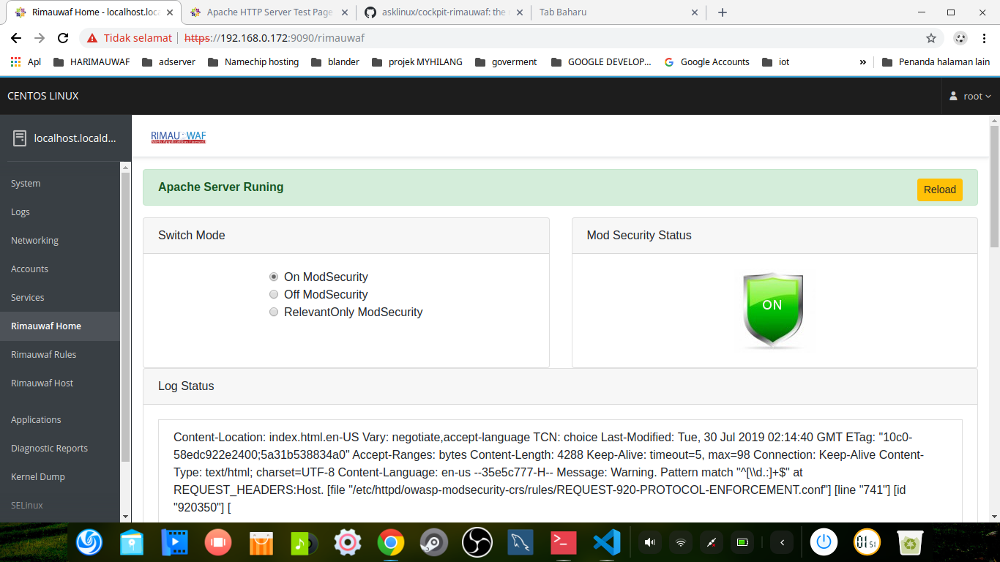

# Cockpit Rimauwaf Plugin



Scaffolding for a [Cockpit](http://www.cockpit-project.org) module.

# Getting and building the source

Make sure you have `npm` available (usually from your distribution package).
These commands check out the source and build it into the `dist/` directory:

```
git clone https://github.com/asklinux/cockpit-rimauwaf.git
cd cockpit-rimauwaf
make
```
#Configure server

install apache and mod_security on centos 8
```
$dnf -y install httpd
$dnf -y install mod_security
$cd /etc/httpd
$git clone https://github.com/SpiderLabs/owasp-modsecurity-crs.git
$cd owasp-modsecurity-crs
$cp crs-setup.conf.example crs-setup.conf

$touch /etc/httpd/conf.d/rimauwaf.conf
$rm -f /etc/httpd/conf.d/mod_security.conf

vi /etc/httpd/conf.d/rimauwaf.conf
```

add configure in rimauwaf.conf

```
<IfModule mod_security2.c>
    # Default recommended configuratiOff
    SecRuleEngine On
    SecRequestBodyAccess Off
    SecRule REQUEST_HEADERS:Content-Type "text/xml" \
         "id:'200000',phase:1,t:none,t:lowercase,pass,nolog,ctl:requestBodyProcessor=XML"
    SecRequestBodyLimit 13107200
    SecRequestBodyNoFilesLimit 131072
    SecRequestBodyInMemoryLimit 131072
    SecRequestBodyLimitAction Reject
    SecRule REQBODY_ERROR "!@eq 0" \
    "id:'200001', phase:2,t:none,log,deny,status:400,msg:'Failed to parse request body.',logdata:'%{reqbody_error_msg}',severity:2"
    SecRule MULTIPART_STRICT_ERROR "!@eq 0" \
    "id:'200002',phase:2,t:none,log,deny,status:400,msg:'Multipart request body \
    failed strict validation: \
    PE %{REQBODY_PROCESSOR_ERROR}, \
    BQ %{MULTIPART_BOUNDARY_QUOTED}, \
    BW %{MULTIPART_BOUNDARY_WHITESPACE}, \
    DB %{MULTIPART_DATA_BEFORE}, \
    DA %{MULTIPART_DATA_AFTER}, \
    HF %{MULTIPART_HEADER_FOLDING}, \
    LF %{MULTIPART_LF_LINE}, \
    SM %{MULTIPART_MISSING_SEMICOLON}, \
    IQ %{MULTIPART_INVALID_QUOTING}, \
    IP %{MULTIPART_INVALID_PART}, \
    IH %{MULTIPART_INVALID_HEADER_FOLDING}, \
    FL %{MULTIPART_FILE_LIMIT_EXCEEDED}'"

    SecRule MULTIPART_UNMATCHED_BOUNDARY "!@eq 0" \
    "id:'200003',phase:2,t:none,log,deny,status:44,msg:'Multipart parser detected a possible unmatched boundary.'"

    SecPcreMatchLimit 1000
    SecPcreMatchLimitRecursion 1000

    SecRule TX:/^MSC_/ "!@streq 0" \
            "id:'200004',phase:2,t:none,deny,msg:'ModSecurity internal error flagged: %{MATCHED_VAR_NAME}'"

    SecResponseBodyAccess Off
    SecDebugLog /var/log/httpd/modsec_debug.log
    SecDebugLogLevel 0
    SecAuditEngine RelevantOnly
    SecAuditLogRelevantStatus "^(?:5|4(?!04))"
    SecAuditLogParts ABIJDEFHZ
    SecAuditLogType Serial
    SecAuditLog /var/log/httpd/modsec_audit.log
    SecArgumentSeparator &
    SecCookieFormat 0
    SecTmpDir /var/lib/mod_security
    SecDataDir /var/lib/mod_security

    # ModSecurity Core Rules Set and Local configuratiOff
	IncludeOptional modsecurity.d/*.conf
        Include owasp-modsecurity-crs/crs-setup.conf
	IncludeOptional modsecurity.d/activated_rules/*.conf
	IncludeOptional modsecurity.d/local_rules/*.conf
    
</IfModule>

```


# Installing

`make install` compiles and installs the package in `/usr/share/cockpit/`. The
convenience targets `srpm` and `rpm` build the source and binary rpms,
respectively. Both of these make use of the `dist-gzip` target, which is used
to generate the distribution tarball. In `production` mode, source files are
automatically minified and compressed. Set `NODE_ENV=production` if you want to
duplicate this behavior.

For development, you usually want to run your module straight out of the git
tree. To do that, link that to the location were `cockpit-bridge` looks for packages:

```
mkdir -p ~/.local/share/cockpit
ln -s `pwd`/dist ~/.local/share/cockpit/rimauwaf
```

After changing the code and running `make` again, reload the Cockpit page in
your browser.

You can also use
[watch mode](https://webpack.js.org/guides/development/#using-watch-mode) to
automatically update the webpack on every code change with

    $ npm run watch

or

    $ make watch

# Running eslint

Cockpit rimauwaf uses [ESLint](https://eslint.org/) to automatically check
JavaScript code style in `.js` and `.jsx` files.

The linter is executed within every build as a webpack preloader.

For developer convenience, the ESLint can be started explicitly by:

    $ npm run eslint

Violations of some rules can be fixed automatically by:

    $ npm run eslint:fix

Rules configuration can be found in the `.eslintrc.json` file.

# Automated Testing

Run `make check` to build an RPM, install it into a standard Cockpit test VM
(centos-7 by default), and run the test/check-application integration test on
it. This uses Cockpit's Chrome DevTools Protocol based browser tests, through a
Python API abstraction. Note that this API is not guaranteed to be stable, so
if you run into failures and don't want to adjust tests, consider checking out
Cockpit's test/common from a tag instead of master (see the `test/common`
target in `Makefile`).

After the test VM is prepared, you can manually run the test without rebuilding
the VM, possibly with extra options for tracing and halting on test failures
(for interactive debugging):

    TEST_OS=centos-7 test/check-application -tvs

You can also run the test against a different Cockpit image, for example:

    TEST_OS=fedora-28 make check

# Vagrant

This directory contains a Vagrantfile that installs and starts cockpit on a
Fedora 26 cloud image. Run `vagrant up` to start it and `vagrant rsync` to
synchronize the `dist` directory to `/usr/local/share/cockit/rimauwaf`. Use
`vagrant rsync-auto` to automatically sync when contents of the `dist`
directory change.

